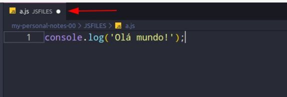
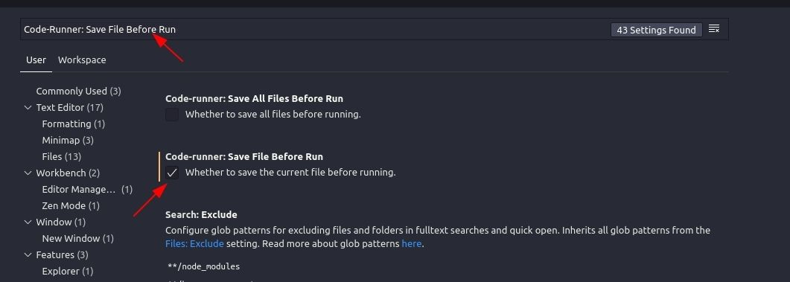

##
### Javascript e TypeScript - front-end e back-end (Full Stack) - Node, Express, noSQL, React, hooks, Redux, Design Patterns
##

### 1 - Instalando NodeJS,VSCode e Chrome no Windows

- Visual Studio Code
  - Link: https://code.visualstudio.com/Download

Extensões
    - `Code Runner`

Executar o arquivo app_01.js

```txt
CRTL + ALT + N

node app_01.js
```

- NodeJS
  - Link: https://nodejs.org/en

- Google Chrome
    - Link: https://www.google.com/intl/pt-BR/chrome/


- Exemplo:
  - app_01


### 2 - Instalando NodeJS,VSCode e Chrome no Linux (Ubunto 18.04)

- Atualizando pacotes

- NodeJS
```txt
sudo apt install curl -y
curl -sl https://deb.nodesource.com/setup_10.x | sudo bash -
sudo apt install nodejs -y
```

- VSCode
```txt
sudo snap install code --classic
```

- Google Chrome
```txt
wget https://dl.google.com/linux/direct/google-chrome-stable_current_amd64.deb
sudo dpkg -i google-chrome-stable_current_amd64.deb
sudo rm google-chrome-stable_current_amd64.deb
```

- Exemplo:
  - app_02


### 3 - Não se esqueça de salvar seus arquivos antes de executar

Antes de executar qualquer arquivo no VS Code, verifique se este está salvo (veja como a seguir).

O editor mostra com uma "bolinha branca" próxima ao nome do arquivo. Isso indica se ele está ou não está salvo.

<p align="center">
  
</p>

Se isso estiver aparecendo, quer dizer que você ainda precisa salvar suas alterações.

Para salvar, você pode pressionar simultâneamente as teclas CTRL + S ou acessar "File" > "Save" (no menu superior).

Você também pode configurar o Code-Runner para salvar seu arquivo automaticamente antes de executar (veja como a seguir).

Acesse: "File" > "Preferences" > "Settings" e pesquise por "Code-Runner: Save File Before Run". Marque a caixa referente a esta opção.

<p align="center">
  
</p>

Pronto, agora você não precisará mais se preocupar em salvar o arquivo antes de executar.

Tenha em mente que é melhor ter o costume de salvar do que deixar que o editor faça isso por você. Isso pode fazer você ter dificuldades em "codar" em outros editores caso queira trocar posteriormente.

- Exemplo:
  - app_03


### 4 - Entenda como o curso está estruturado

- Exemplo:
  - app_04


### 5 - Perguntas e Respostas - Como funciona?

- Exemplo:
  - app_05


### 6 - Seção de HTML e CSS (Novo)

- Exemplo:
  - app_06

